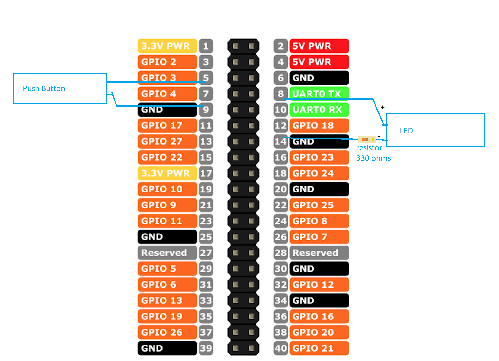

# Soft power button for Raspberry Pi

Easily install a soft power button on Raspberry Pi

# Background

Like ATX Power supply purpose on PCs, we need to avoid corrupted or lost data when turning off devices with embedded operating system environments.
So, this is a simple way to install and use a similar resource for Raspberry Pi with Raspbian.

## Requirements:
* Raspberry Pi with Raspbian
* Push-button (with or without LED)

>If your button have LED use a resistor to drop-down current  
Use this to calculate the resistor value: https://www.hobby-hour.com/electronics/ledcalc.php

## Hardware connection

  
>In my specific case the resistor needed was 330 Ω

## Install

* Run in Raspberry Pi Terminal:
```bash
/bin/bash -c "$(curl -fsSL https://raw.githubusercontent.com/alexandremendoncaalvaro/soft-power-button-raspberry/master/install.sh)"
```

* Reboot Raspberry Pi

* Done!

## Usage

Like in modern PCs, just press the power button to turn it on or off.

# References
https://macrofab.com/blog/power-control-product-starting-stopping-electrons/  
https://howchoo.com/g/mwnlytk3zmm/how-to-add-a-power-button-to-your-raspberry-pi  
https://github.com/Howchoo/pi-power-button  
https://gist.github.com/massimomusante/a7a6976654cb832ca7b523e903b0209e  
https://gist.github.com/massimomusante/fbc2cf5170be469f7cecb96963f61eae  
